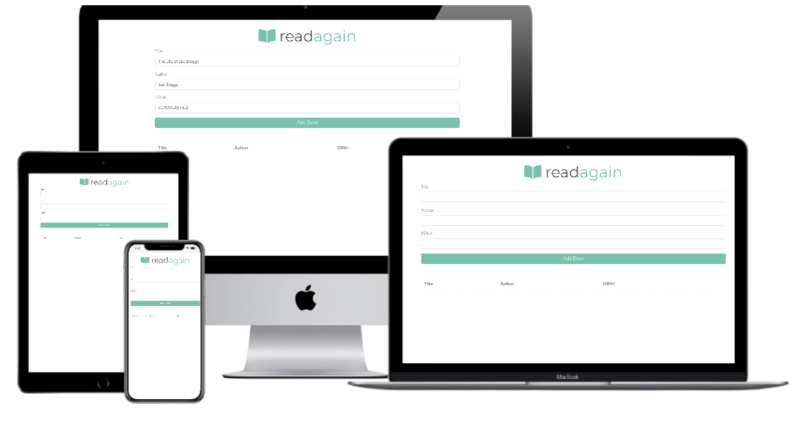

<h1 align="center">
 
  
   
     
  JavaScript - Book List App
   
</h1>

<h3 align="center">Self-Taught Programming</h3>

<h4 align="center">A Book List Using Using Classes, and Local Storage</h4>